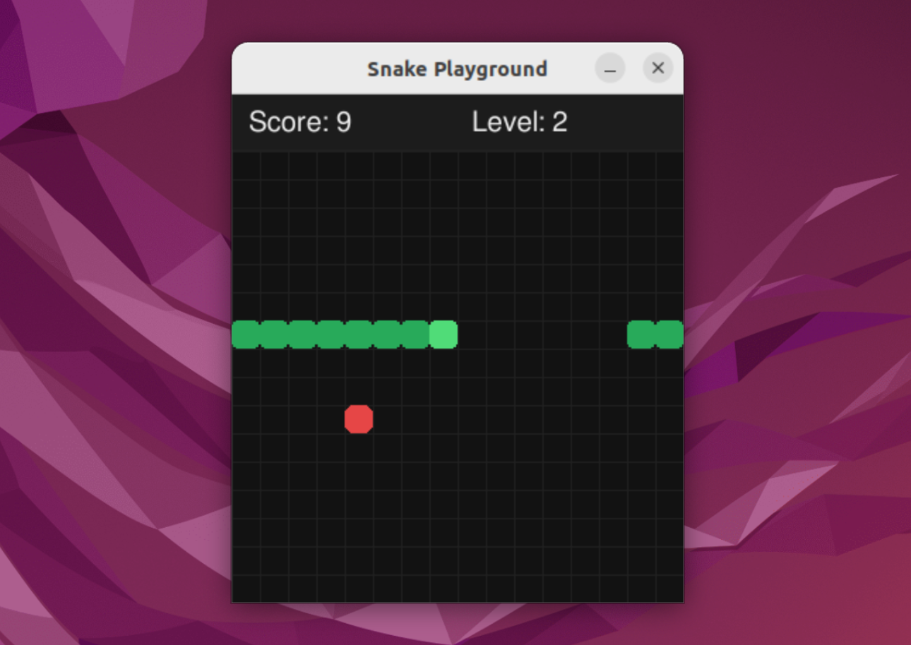

# Snake Playground

這是一個使用 Python 與 pygame 製作的可實際遊玩的貪吃蛇遊戲，並使用 `pipenv` 管理虛擬環境與套件。

## Preview

<p align="center">
  
</p>

## 環境安裝

1. 安裝 Python 3
2. 安裝 `pipenv`

```bash
pip install pipenv
```

如果你的系統已安裝 `pipenv`，可以直接進行下一步。

## 專案啟動流程

1. 安裝專案依賴

```bash
pipenv install
```

2. 啟動虛擬環境

```bash
pipenv shell
```

3. 執行遊戲

```bash
python main.py
```

## 遊戲說明

### 操作方式

- 啟動後會先進入主選單。
- 主選單可使用方向鍵切換選項，按 `Enter` 或 `Space` 確認。
- 主選單也支援滑鼠點擊 `Start Game`、`High Scores`、`Quit`。
- 遊戲中使用鍵盤方向鍵控制蛇移動。
- 遊戲結束後可按 `Enter`、`Space` 或 `R` 重新開始，也可按 `Esc` 或 `M` 返回主選單。
- 若本次分數進入前五名，遊戲結束後會進入名字輸入流程；按 `Enter` 提交，空白名稱會自動使用 `Player`。
- 排行榜畫面可按 `Enter`、`Space`、`Backspace` 或 `Esc` 返回主選單。

### 遊戲規則

- 吃到紅色食物後，蛇身會變長。
- 等級依據吃到的食物數量提升，而不是依據分數直接提升。
- 每吃到 `5` 個食物提升 `1` 個等級，Level 1 為起始等級。
- Level 1 每次吃到食物加 `1` 分，Level 2 每次加 `2` 分，Level 3 每次加 `3` 分，之後依此類推。
- 遊戲速度會依據目前等級自動調整，Level 1 為 `6 FPS`，每提升 1 個等級增加 `1 FPS`，最高為 `20 FPS`。
- 撞到牆壁時會從另一側穿出（wrap-around），只有撞到自己時才會遊戲結束。
- 遊戲區大小為 `320 x 320`，HUD 位於上方且不會覆蓋遊戲區。
- HUD 只顯示目前分數與等級，不顯示速度。
- 遊戲啟動後會先進入主選單，可選擇 `Start Game`、`High Scores` 或 `Quit`。
- 排行榜會顯示前五名玩家名稱與分數，並使用本地檔案 `data/high_scores.json` 持久化保存紀錄。
